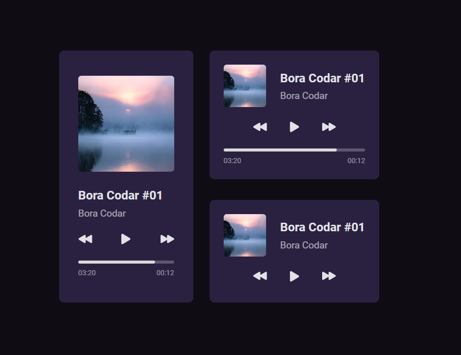
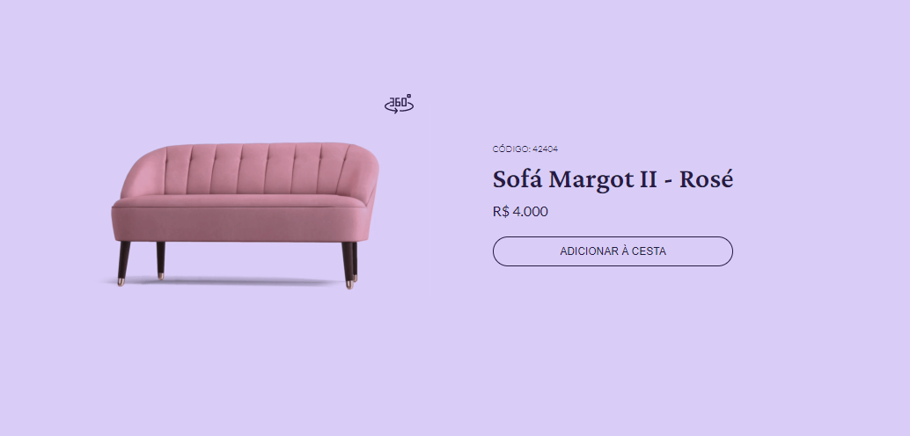
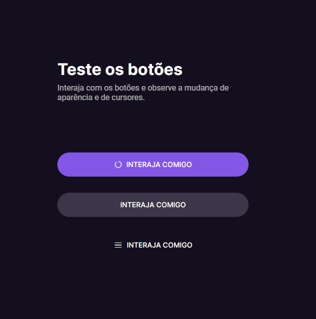
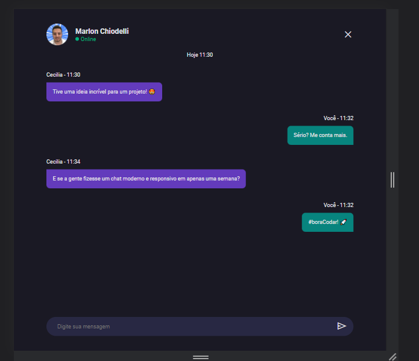
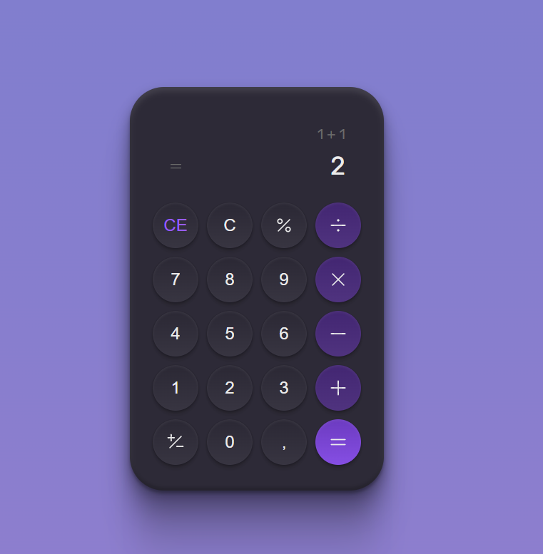
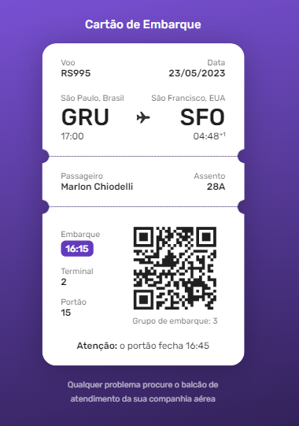

<h1 align="center">#BoraCodar</h1>

    Série de desafios semanais oferecidos pela Rocketseat.

  <a href="#-tecnologias">Tecnologias</a>&nbsp;&nbsp;&nbsp;|&nbsp;&nbsp;&nbsp;
  <a href="#memo-licença">Licença</a>&nbsp;&nbsp;&nbsp;|&nbsp;&nbsp;&nbsp;
  <a href="#-contato">Contato</a>

  

 

<h2 align="center">Desafio 01 - Player de Música</h2>

  

 
<h2 align="center">Desafio 02 - Card de Produto</h2>

  

<h2 align="center">Desafio 03 - Botões e Cursores</h2>

  

<h2 align="center">Desafio 04 - Chat</h2>

  

<h2 align="center">Desafio 05 - Calculadora</h2>

  

<h2 align="center">Desafio 06 - Cartão de Embarque</h2>

  

## 🚀 Tecnologias

Esse projeto foi desenvolvido com as seguintes tecnologias:

  * __HTML__
  * __CSS__
  * __JavaScript__ 

## :memo: Licença

Esse projeto está sob a [licença MIT](LICENSE).

## :email: Contato

E-mail: [**marlonchiodelli@hotmail.com**](mailto:marlonchiodelli@hotmail.com)
---